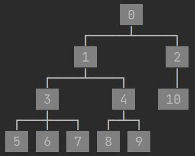
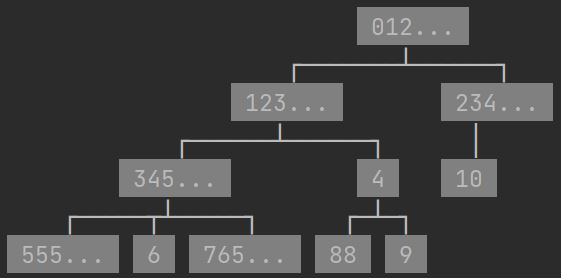
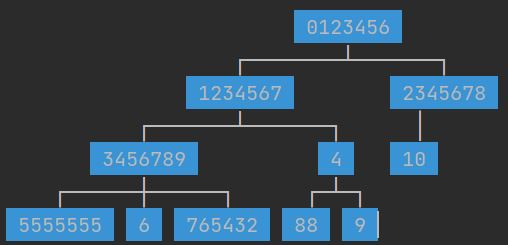
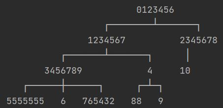
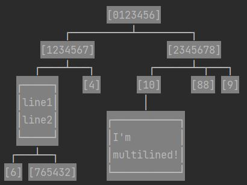
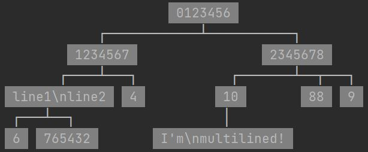

# PrettyPrintTree

This package allows you to print the tree datastructure in a readable fashion (in Java).

It supports trees with any kind of data (as long it can be turned into a string).

And even supports multi lined nodes (as in strings with \n).


# Install

You can install the .jar directly or use jitpack: https://jitpack.io/#AharonSambol/PrettyPrintTreeJava

# Documentation

I tried to make this as flexible as possible, so in order to support multiple types of trees
you need to explain to the program how to print your tree. The way to accomplish this is by passing 2 lambdas:
1) getChildren: Given a node of your tree type returns a List of all its children (from left to right).
    For example if this is your tree implementation:
    ```java
    class Tree<T>{
        private final T val;
        private final ArrayList<Tree<T>> children;
        public Tree(T val){
            this.val = val;
            children = new ArrayList<>();
        }
        public Tree<T> addChild(T child){
            var c = new Tree<T>(child);
            children.add(c);
            return c;
        }
        public T getValue(){ return this.val; }
        public ArrayList<Tree<T>> getChildren() { return this.children; }
    }
    ```
    Then getChildren would be as simple as:
    ```java
    (x) -> x.getChildren()
    ```
    or even
    ```java
    Tree::getChildren
    ```
    Or if your tree implementation is:
    ```java
    class Tree<T>{
        private final T val;
        private Tree<T> rChild, lChild;
        public Tree(T val){
            this.val = val;
        }
        public void setRightChild(T child){
            rChild = new Tree<T>(child);
        }
        public void setLeftChild(T child){
            lChild = new Tree<T>(child);
        }
        public T getValue(){ return this.val; }
        public Tree<T> getRChild() {    return this.rChild; }
        public Tree<T> getLChild() {    return this.lChild; }
    }
    ```
    Then getChildren would be:
    ```java
    (x) -> new ArrayList<>(){{
            add(x.getLChild());
            add(x.getRChild());
        }}
    ```

2) getValue: Given a node of your tree type returns that node's value
    for example if your tree implementation has:
    ```java
    public String getValue(){ 
        return this.val.toString(); 
    }
    ```
    then getValue would be:
    ```java
    (x) -> x.getValue()
    ```
    or even
    ```
    Tree::getValue
    ```


In order to print the tree you first need to make a PrettyPrintTree object which you pass your lambdas to,
then you can set it's settings (explained in "Other Settings"),
then you can call it whenever you want without needing to pass the lambdas each time.


## Examples

### Custom Tree Class

```java
import java.util.*;
class Tree<T>{
    private final T val;
    private final ArrayList<Tree<T>> children;
    public Tree(T val){
        this.val = val;
        children = new ArrayList<>();
    }
    public Tree<T> addChild(T child){
        var c = new Tree<T>(child);
        children.add(c);
        return c;
    }
    public T getValue(){ return this.val; }
    public ArrayList<Tree<T>> getChildren() { return this.children; }
}


public class Example{
    public static void main(String[] args){
        var tree = new Tree<String>("0");
        var c1 = tree.addChild("1");
        var c2 = tree.addChild("2");
        var c1_1 = c1.addChild("3");
        var c1_2 = c1.addChild("4");
        c1_1.addChild("5");
        c1_1.addChild("6");
        c1_1.addChild("7");
        c1_2.addChild("8");
        c1_2.addChild("9");
        c2.addChild("10");
        var pt = new PrettyPrintTree<Tree<String>>(
                Tree::getChildren,
                Tree::getValue
        );
        pt.display(tree);
    }
}
```


### DefaultTreeModel

Or if you already have a Swing TreeModel made from DefaultMutableTreeNodes, the example from above would look like thie:

```java
import java.util.*;
import javax.swing.tree.*;

public class Example{
    public static void main(String[] args){
        DefaultMutableTreeNode tree=new DefaultMutableTreeNode("0");
        DefaultMutableTreeNode c1=new DefaultMutableTreeNode("1");
        DefaultMutableTreeNode c2=new DefaultMutableTreeNode("2");
        DefaultMutableTreeNode c1_1=new DefaultMutableTreeNode("3");
        DefaultMutableTreeNode c1_2=new DefaultMutableTreeNode("4");
        tree.add(c1);
        tree.add(c2);
        c1.add(c1_1);
        c1.add(c1_2);
        c1_1.add(new DefaultMutableTreeNode("5"));
        c1_1.add(new DefaultMutableTreeNode("6"));
        c1_1.add(new DefaultMutableTreeNode("7"));
        c1_2.add(new DefaultMutableTreeNode("8"));
        c1_2.add(new DefaultMutableTreeNode("9"));
        c2.add(new DefaultMutableTreeNode("10"));
        
        var pt = new PrettyPrintTree<DefaultMutableTreeNode>(
                (x) -> new ArrayList(Collections.list(x.children())),
                (x) -> x.getUserObject().toString()
        );
        pt.display(tree);
        System.out.println();
    }
}
```

# Other Settings

In order to change the way the tree prints, you can change the settings. 
This is done after making the PrettyPrintTree object and before calling the display function.
eg:
```java
var pt = new PrettyPrintTree<Tree<String>>(...);
// settings:
pt.setTrim(3);
// print:
pt.display(tree);
```

## Trim
Say you only want to print the first few characters of each node (in order to keep the tree small for readability),
then you can set trim to a specific amount of characters.

```java
pt.setTrim(3);
```



## Return Instead of Print
Instead of printing the tree it can return the string instead if you prefer.

Instead of calling
```java
pt.display(tree);
```
You can call
```java
String res = pt.toStr(tree);
```


## Color
You can change the bg color of each node, or even just not use color.

```java
pt.setColor(Color.BLUE);
```

```java
pt.setColor(Color.NONE);
```



## Border
You can also surround each node with a little border:
```java
pt.setBorder(true);
```



## Escape NewLines
You can escape \n so that each node will be printed on one line.

Note: \\n will be escaped into \\\\n so that you can tell the difference
```java
pt.setEscapeNewline(true);
```



## Max Depth
You can specify a max depth so that it will only print nodes up to that depth.
This can be done either at the start:
```java
pt.setMaxDepth(2);
```
Or when calling the function:
```java
pt.display(tree, 2);
```
This will override the max depth set at the start (if any) for this time only.
To have no max depth, you can set it to -1.


## Dictionaries \ JSON

Coming soon


## Labels

Coming soon


## Horizontal

Coming soon 


# Python

I made a Python version too:
https://github.com/AharonSambol/PrettyPrintTree

# C#

I made a C# version too:
[https://github.com/AharonSambol/PrettyPrintTree](https://github.com/AharonSambol/PrettyPrintTreeCSharp)
